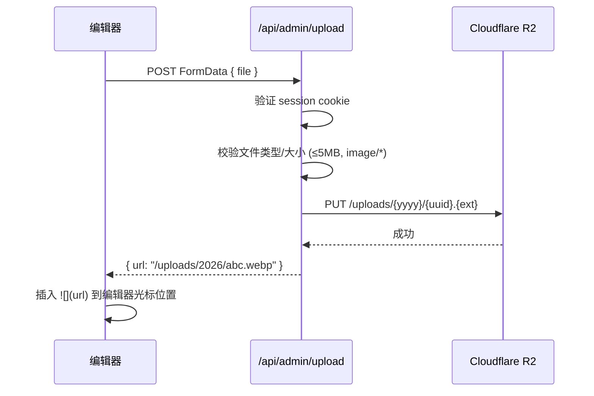

# Phase 5 — 管理后台技术规划

## 1. 总览

### 1.1 核心决策

| 决策项 | 结论 |
|--------|------|
| 帖子存储 | Cloudflare D1 数据库（放弃 Content Collections） |
| Markdown 编辑器 | CodeMirror 6 + 站点 prose 样式实时预览/切换 |
| 后台布局 | 复用主站 BaseLayout（赛博终端风格） |
| 管理员鉴权 | 环境变量 `ADMIN_PASSWORD`（单密码） + D1 `sessions` 表 |
| 图片存储 | Cloudflare R2 对象存储 |
| 评论机制 | 无审核直发，IP 级限流（默认 5 条 / 10 分钟） |

### 1.2 模块清单

| # | 模块 | 路由 | 说明 |
|---|------|------|------|
| 1 | 登录 | `/admin/login` | 密码验证 → session cookie |
| 2 | 统计看板 | `/admin` | 总文章/浏览/评论/今日趋势 |
| 3 | 帖子管理 | `/admin/posts`, `/admin/posts/new`, `/admin/posts/edit/[id]` | CRUD + Markdown 编辑器 |
| 4 | 评论管理 | `/admin/comments` | 查看/删除，分页浏览 |
| 5 | 友链管理 | `/admin/links` | 增/删/改/排序 |
| 6 | 站点设置 | `/admin/settings` | 标题/Logo/占位文字/TPM 等 |

### 1.3 渲染策略

所有 `/admin/*` 页面使用 SSR（`export const prerender = false`），服务端直接查 D1 渲染数据，不暴露管理 API 给前端。

---

## 2. 数据库 Schema 变更

### 2.1 新增：`posts` 表

替代现有的 Content Collections（`src/content/posts/*.md`），所有文章数据存入 D1。

```sql
CREATE TABLE IF NOT EXISTS posts (
  id          TEXT PRIMARY KEY DEFAULT (lower(hex(randomblob(16)))),
  slug        TEXT NOT NULL UNIQUE,          -- URL 路径标识，如 "hello-world"
  title       TEXT NOT NULL,
  description TEXT DEFAULT '',               -- 文章摘要 / SEO 描述
  content     TEXT NOT NULL,                 -- Markdown 原文
  hero_image  TEXT,                          -- 封面图 URL（R2 路径）
  tags        TEXT DEFAULT '[]',             -- JSON 数组，如 '["astro","blog"]'
  status      TEXT DEFAULT 'draft' CHECK(status IN ('draft','published')),
  created_at  DATETIME DEFAULT CURRENT_TIMESTAMP,
  updated_at  DATETIME DEFAULT CURRENT_TIMESTAMP
);
CREATE INDEX IF NOT EXISTS idx_posts_status ON posts(status, created_at);
CREATE INDEX IF NOT EXISTS idx_posts_slug ON posts(slug);
```

**关键设计**：
- `slug` 唯一且用于 URL（`/blog/hello-world`），取代 Content Collections 的文件名
- `tags` 存为 JSON 字符串，查询时用 `json_each()` 展开
- `status` 支持草稿 / 已发布，草稿仅管理后台可见
- `content` 存 Markdown 原文，前台渲染时实时编译为 HTML

### 2.2 新增：`site_settings` 表

Key-Value 模式，存储所有可在后台动态配置的站点参数。

```sql
CREATE TABLE IF NOT EXISTS site_settings (
  key         TEXT PRIMARY KEY,
  value       TEXT NOT NULL,
  updated_at  DATETIME DEFAULT CURRENT_TIMESTAMP
);
```

**预设 Key 清单**：

| key | 默认值 | 说明 |
|-----|--------|------|
| `site.title` | `秋月佑空の站` | 网站标题（覆盖 i18n） |
| `site.description` | `一个分享技术与生活的...` | 网站描述 |
| `site.logo_text` | （同 site.title） | 左上角 Logo 文字（可独立于标题） |
| `hero.title` | `こんにちは、世界` | 首页 Hero 标题 |
| `hero.description` | `欢迎来到...` | 首页 Hero 副标题 |
| `comment.tpm_limit` | `5` | 评论限流：每个窗口期最大条数 |
| `comment.tpm_window` | `600` | 评论限流：窗口期秒数（默认 600 = 10 分钟） |
| `footer.text` | `© 2026 ...` | 页脚文字 |

### 2.3 改造：`comments` 表

现有表结构基本不动，只做逻辑改造：

```diff
- status TEXT DEFAULT 'pending'
+ status TEXT DEFAULT 'approved'
```

新增索引以支持 TPM 限流查询：

```sql
CREATE INDEX IF NOT EXISTS idx_comments_ip_time ON comments(ip_hash, created_at);
```

### 2.4 改造：`links` 表

现有 schema 已够用，无需改结构。需要在 `d1.ts` 中补充 `createLink`、`updateLink`、`deleteLink` 函数。

### 2.5 保留：`sessions` 表

现有 schema 已满足需求，无需修改。

### 2.6 FTS 同步策略

现有 `posts_fts` 虚拟表继续使用。在帖子 CRUD 时同步：
- **创建帖子**：`INSERT INTO posts_fts (slug, title, description, content, tags, pub_date) VALUES (...)`
- **更新帖子**：先 `DELETE FROM posts_fts WHERE slug = ?` 再 `INSERT`
- **删除帖子**：`DELETE FROM posts_fts WHERE slug = ?`

---

## 3. 数据迁移：Content Collections → D1

### 3.1 迁移脚本

编写一次性迁移脚本 `db/migrate-posts.ts`，读取 `src/content/posts/*.md` 的 frontmatter + 正文，INSERT 到 `posts` 表。

### 3.2 前台改造

| 位置 | 现有实现 | 改造后 |
|------|---------|--------|
| `/blog` 列表页 | `getCollection('posts')` | `SELECT * FROM posts WHERE status='published' ORDER BY created_at DESC` |
| `/blog/[...slug]` 详情页 | `getEntry('posts', slug)` | `SELECT * FROM posts WHERE slug=? AND status='published'` |
| `/blog/tag/[tag]` 标签页 | 内存 filter | `SELECT * FROM posts WHERE status='published' AND tags LIKE '%"tag"%'` |
| Markdown 渲染 | Astro 内置构建时编译 | 运行时调用 `unified` + `remark` + `rehype` 管线 |
| RSS / Sitemap | Content Collections API | 查 D1 |

> [!WARNING]
> 最大的改造点是 **Markdown 运行时渲染**。Content Collections 在构建时编译 Markdown，迁移到 D1 后需要在 SSR 请求时实时编译。需要引入 `unified` + `remark-parse` + `remark-rehype` + `rehype-stringify` 管线，并确保与现有的 remark-callouts 插件兼容。

---

## 4. 鉴权与中间件

### 4.1 登录流程

```mermaid
sequenceDiagram
    participant U as 用户
    participant L as /admin/login
    participant M as Middleware
    participant D as D1 sessions

    U->>L: POST { password }
    L->>L: 比对 env.ADMIN_PASSWORD
    alt 密码正确
        L->>D: INSERT session token (有效期 7 天)
        L->>U: Set-Cookie: session=token; HttpOnly; Secure; SameSite=Strict
        L->>U: 302 → /admin
    else 密码错误
        L->>U: 返回错误提示
    end

    U->>M: 访问 /admin/*
    M->>M: 读取 Cookie 中的 session token
    M->>D: SELECT * FROM sessions WHERE token=? AND expires_at > now()
    alt 有效 session
        M->>U: 放行，继续渲染页面
    else 无效/过期
        M->>U: 302 → /admin/login
    end
```

### 4.2 Middleware 实现

新建 `src/middleware.ts`：

```typescript
// 伪代码
export const onRequest = async (context, next) => {
  const url = new URL(context.request.url);
  
  // 仅拦截 /admin/* (排除 /admin/login)
  if (url.pathname.startsWith('/admin') && url.pathname !== '/admin/login') {
    const cookie = parseCookie(context.request.headers.get('cookie'));
    const token = cookie['session'];
    
    if (!token) return redirect('/admin/login');
    
    const db = context.locals.runtime.env.DB;
    const session = await db
      .prepare('SELECT * FROM sessions WHERE token = ? AND expires_at > datetime("now")')
      .bind(token)
      .first();
    
    if (!session) return redirect('/admin/login');
  }
  
  return next();
};
```

### 4.3 登出

`/admin/logout`（GET）：删除 D1 中的 session 记录 + 清除 Cookie + 302 → `/admin/login`。

---

## 5. 各模块页面详细设计

### 5.1 登录页 `/admin/login`

**渲染**：SSR，不经过 middleware（公开页面）。

**UI**：
- 居中卡片，赛博终端风格毛玻璃面板
- 一个密码输入框 + 登录按钮
- 错误时显示 Toast 提示
- 支持 Enter 键提交

**后端**：
- `GET`：渲染登录表单
- `POST`：验证密码 → 创建 session → Set-Cookie → 302

---

### 5.2 统计看板 `/admin`

**数据查询**（SSR 服务端）：

| 指标 | SQL |
|------|-----|
| 总文章数 | `SELECT COUNT(*) FROM posts WHERE status='published'` |
| 总浏览量 | `SELECT SUM(view_count) FROM page_views` |
| 总评论数 | `SELECT COUNT(*) FROM comments` |
| 今日 PV | `SELECT SUM(count) FROM daily_views WHERE date = date('now')` |
| 近 7 天趋势 | `SELECT date, SUM(count) FROM daily_views WHERE date >= date('now','-7 days') GROUP BY date` |
| 热门文章 Top 5 | `SELECT slug, view_count FROM page_views ORDER BY view_count DESC LIMIT 5` |

**UI**：
- 顶部 4 个统计卡片（文章/浏览/评论/今日PV），带数字和图标
- 中间区域：7 天 PV 趋势折线图（纯 CSS/SVG 实现，不引入 Chart.js）
- 底部：热门文章排行表格
- 侧边/顶部：快捷入口（写新文章、查看待处理评论）

---

### 5.3 帖子管理

#### 5.3.1 列表页 `/admin/posts`

**UI**：
- 顶部："新建文章" 按钮
- 表格列：标题 | 状态（draft/published 标签） | 标签 | 创建时间 | 浏览量 | 操作（编辑/删除）
- 支持按状态筛选（全部/已发布/草稿）
- 删除需二次确认（弹窗）

#### 5.3.2 编辑器页 `/admin/posts/new` 和 `/admin/posts/edit/[id]`

这是整个后台**最核心、最复杂**的页面。

**布局**：
```
┌──────────────────────────────────────────────┐
│  标题输入栏  [slug 自动生成]  [发布/草稿按钮] │
├──────────────────────────────────────────────┤
│  标签输入（Tag pills + 输入框）               │
├──────────────────────────────────────────────┤
│  封面图上传（拖拽/点击上传 → R2）             │
├──────────────────────────────────────────────┤
│  摘要输入栏（description textarea）           │
├───────────────────────┬──────────────────────┤
│                       │                      │
│   CodeMirror 6        │   实时预览            │
│   Markdown 编辑器     │   (prose 样式渲染)    │
│                       │                      │
│                       │                      │
└───────────────────────┴──────────────────────┘
```

**CodeMirror 6 配置**：
- 语言：`@codemirror/lang-markdown` + `@codemirror/language-data`（代码块内语法高亮）
- 主题：自定义暗色/亮色主题，匹配站点设计令牌
- 扩展：行号、括号匹配、自动缩进、快捷键（Ctrl+B 加粗、Ctrl+I 斜体等）
- 图片粘贴/拖拽：监听 paste/drop 事件 → 上传到 R2 → 插入 ``

**实时预览**：
- 编辑区和预览区并排显示，可通过按钮切换「分栏 / 纯编辑 / 纯预览」三种模式
- 预览区使用站点的 `prose` CSS 类渲染，与前台文章详情页完全一致
- 预览内容通过前端 JS 调用轻量 Markdown 解析器（`marked` 或 `markdown-it`）实时生成
- 编辑器滚动时预览区同步滚动

**Slug 自动生成**：
- 标题输入时自动生成 slug（中文 → 拼音或直接保留，去特殊字符，空格转 `-`）
- slug 可手动编辑覆盖
- 编辑已有文章时 slug 不可修改（防止链接失效）

**表单提交**：
- 页面用 `<form method="POST">` 提交到自身
- 服务端接收后 INSERT/UPDATE `posts` 表 + 同步 `posts_fts` 表
- 成功后 302 → `/admin/posts`

---

### 5.4 评论管理 `/admin/comments`

**UI**：
- 表格列：文章标题 | 作者 | 内容摘要 | IP Hash（脱敏） | 时间 | 操作（删除）
- 分页（每页 20 条）
- 按文章筛选下拉框
- 删除需二次确认

**数据查询**：
```sql
SELECT c.*, p.title as post_title 
FROM comments c 
LEFT JOIN posts p ON c.post_slug = p.slug 
ORDER BY c.created_at DESC 
LIMIT 20 OFFSET ?
```

---

### 5.5 友链管理 `/admin/links`

**UI**：
- 顶部："添加友链" 按钮 → 展开内联表单（名称/URL/头像URL/描述）
- 列表：卡片或表格展示，每项有 编辑/删除 按钮
- 拖拽排序（修改 `sort_order` 字段）

**D1 新增操作**：
```typescript
createLink(db, { name, url, avatar?, description? })
updateLink(db, id, { name, url, avatar?, description?, sort_order? })
deleteLink(db, id)
```

---

### 5.6 站点设置 `/admin/settings`

**UI**：分组展示的表单面板

```
┌─ 基本信息 ─────────────────────────────┐
│  网站标题:    [___________________]     │
│  Logo 文字:   [___________________]     │
│  网站描述:    [___________________]     │
└─────────────────────────────────────────┘
┌─ 首页配置 ─────────────────────────────┐
│  Hero 标题:   [___________________]     │
│  Hero 副标题: [___________________]     │
│  页脚文字:    [___________________]     │
└─────────────────────────────────────────┘
┌─ 评论限流 ─────────────────────────────┐
│  单IP最大条数: [5__]                    │
│  窗口期(秒):   [600]                    │
└─────────────────────────────────────────┘
                              [保存设置]
```

**后端**：
- `GET`：读取 `site_settings` 全部 key-value → 渲染表单
- `POST`：遍历表单字段 → `INSERT OR REPLACE INTO site_settings` → 302 回自身 + Toast 提示

---

## 6. R2 图片上传

### 6.1 上传流程



### 6.2 API 端点

`src/pages/api/admin/upload.ts`：
- 仅接受 POST
- 验证 session cookie（复用 middleware 逻辑）
- 读取 FormData 中的 file
- 生成路径：`uploads/{year}/{uuid}.{ext}`
- 写入 R2：`env.BUCKET.put(key, file.stream(), { httpMetadata: { contentType } })`
- 返回 JSON `{ url }`

### 6.3 R2 公开访问

在 `wrangler.jsonc` 中配置 R2 绑定后，通过 Astro 的 catch-all 路由 `/uploads/[...path].ts` 代理 R2 读取，或配置 R2 自定义域名直接公开访问。

---

## 7. 实施顺序与依赖关系

### 阶段 A：基础设施（不涉及 UI）

| # | 任务 | 依赖 |
|---|------|------|
| A1 | 更新 `db/schema.sql`：新增 `posts` 表、`site_settings` 表、新索引 | 无 |
| A2 | 更新 `wrangler.jsonc`：添加 D1 绑定、R2 绑定 | 无 |
| A3 | 扩展 `src/lib/cloudflare/d1.ts`：新增 posts CRUD、links CRUD、settings CRUD、评论限流查询 | A1 |
| A4 | 新建 `src/lib/cloudflare/r2.ts`：图片上传/读取封装 | A2 |
| A5 | 新建 `src/lib/markdown.ts`：运行时 Markdown → HTML 管线（unified + remark + rehype + callouts） | 无 |
| A6 | 新建 `src/lib/settings.ts`：读取 site_settings 并与 i18n 默认值合并 | A3 |

### 阶段 B：鉴权系统

| # | 任务 | 依赖 |
|---|------|------|
| B1 | 新建 `src/middleware.ts`：/admin/* 路由拦截 + session 校验 | A3 |
| B2 | 新建 `/admin/login` 页面 + 后端逻辑 | B1 |
| B3 | 新建 `/admin/logout` 路由 | B1 |

### 阶段 C：前台改造（Content Collections → D1）

| # | 任务 | 依赖 |
|---|------|------|
| C1 | 改造 `/blog`：从 `getCollection` 切换为 D1 查询 | A3, A5 |
| C2 | 改造 `/blog/[...slug]`：从 `getEntry` 切换为 D1 查询 + 运行时 MD 渲染 | A3, A5 |
| C3 | 改造 `/blog/tag/[tag]`：从内存 filter 切换为 D1 JSON 查询 | A3 |
| C4 | 改造首页：最新文章从 D1 查询，Hero 文字从 settings 读取 | A3, A6 |
| C5 | 改造评论 API：去除审核流程，添加 IP 限流 | A3, A6 |
| C6 | 改造 Header/Footer：Logo/页脚文字从 settings 动态读取 | A6 |
| C7 | 编写迁移脚本 `db/migrate-posts.ts` + 执行迁移 | A3 |

### 阶段 D：后台页面（简单模块）

| # | 任务 | 依赖 |
|---|------|------|
| D1 | 新建 `/admin`（统计看板） | B2 |
| D2 | 新建 `/admin/comments`（评论管理） | B2 |
| D3 | 新建 `/admin/links`（友链管理） | B2 |
| D4 | 新建 `/admin/settings`（站点设置） | B2, A6 |
| D5 | 新建 `src/styles/admin.css`（后台专属样式） | 无 |

### 阶段 E：后台页面（核心模块）

| # | 任务 | 依赖 |
|---|------|------|
| E1 | 新建 `/api/admin/upload.ts`（R2 图片上传 API） | A4, B1 |
| E2 | 新建 `/admin/posts`（帖子列表页） | B2 |
| E3 | 新建 `/admin/posts/new` + `/admin/posts/edit/[id]`（CodeMirror 编辑器页） | E1, E2, A5 |
| E4 | 实现编辑器内粘贴/拖拽图片自动上传 | E1, E3 |

### 阶段 F：收尾

| # | 任务 | 依赖 |
|---|------|------|
| F1 | 后台导航栏（侧边/顶部快捷入口） | D1-E3 |
| F2 | 整体 UI 微调 + 响应式适配 | 全部 |
| F3 | 更新 `.agent` 规范文档 | 全部 |

---

## 8. 新增文件结构

```
src/
├── middleware.ts                          # ← 新建：鉴权拦截
├── lib/
│   ├── cloudflare/
│   │   ├── d1.ts                          # ← 扩展：+posts/links/settings CRUD
│   │   ├── r2.ts                          # ← 新建：图片上传封装
│   │   └── search.ts
│   ├── markdown.ts                        # ← 新建：运行时 MD→HTML
│   └── settings.ts                        # ← 新建：动态站点配置读取
├── pages/
│   ├── admin/
│   │   ├── login.astro                     # ← 新建
│   │   ├── logout.ts                      # ← 新建
│   │   ├── index.astro                    # ← 新建：统计看板
│   │   ├── posts/
│   │   │   ├── index.astro                # ← 新建：帖子列表
│   │   │   ├── new.astro                  # ← 新建：新建文章
│   │   │   └── edit/[id].astro            # ← 新建：编辑文章
│   │   ├── comments.astro                 # ← 新建
│   │   ├── links.astro                    # ← 新建
│   │   └── settings.astro                 # ← 新建
│   └── api/admin/
│       └── upload.ts                      # ← 新建：R2 图片上传
├── styles/
│   └── admin.css                          # ← 新建：后台专属样式
└── components/
    └── admin/
        ├── AdminNav.astro                     # ← 新建：后台侧边导航
        ├── StatsCard.astro                    # ← 新建：统计卡片
        ├── DataTable.astro                    # ← 新建：通用数据表格
        └── ConfirmDialog.astro                # ← 新建：删除确认弹窗

db/
├── schema.sql                             # ← 更新：+posts/site_settings/新索引
└── migrate-posts.ts                       # ← 新建：一次性迁移脚本
```

## 9. 依赖包清单

| 包名 | 用途 |
|------|------|
| `@codemirror/view` | 编辑器核心 |
| `@codemirror/state` | 编辑器状态管理 |
| `@codemirror/lang-markdown` | Markdown 语言支持 |
| `@codemirror/language-data` | 代码块内多语言高亮 |
| `@codemirror/theme-one-dark` | 暗色主题基础（可自定义覆盖） |
| `marked` 或 `markdown-it` | 前端实时预览用轻量 MD 解析 |
| `unified` + `remark-*` + `rehype-*` | 服务端运行时 MD → HTML（前台文章渲染） |

## 10. 关键注意事项

> [!IMPORTANT]
> 1. **所有 `/admin/*` 页面必须声明 `export const prerender = false`**，否则 Astro 会在构建时尝试静态生成它们，而此时没有 D1 绑定会报错。
> 2. **前台文章页也需要切换为 SSR**（`prerender = false`），因为内容现在来自 D1 而非文件系统。
> 3. **本地开发无 D1/R2**：需要用 `wrangler dev` 代替 `astro dev`，或在代码中做优雅降级（无 DB 时显示占位数据）。
> 4. **CodeMirror 是纯前端组件**，不能放在 `.astro` 的服务端代码中。需要用 Svelte 或原生 JS 封装，并通过 `client:only` 指令加载。
> 5. **样式规范**：后台所有样式统一写入 `src/styles/admin.css`，禁止 scoped `<style>`（遵循 gotchas #8）。
> 6. **评论限流的窗口期和最大条数从 `site_settings` 读取**，不要写死在代码中。
